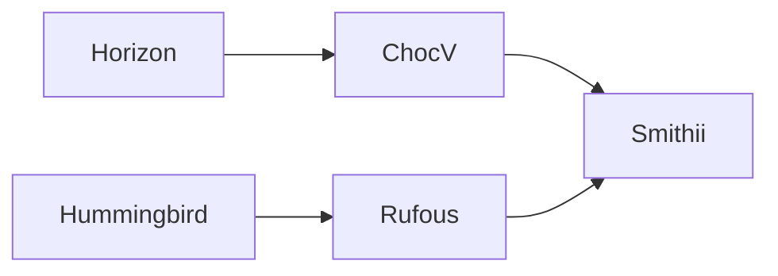

# Tlalocohyla Smithii

These keyboards were my inspiration:

In a nutshell...
- I really liked the Horizon/ChocV construction design and the end result of a low-profile case, just PCBs, nuts and screws.
- And I also liked the Hummingbird/Rufous 30-key layout and the awesome Xiao BLE to package a full Bluetooth keyboard powered by ZMK firmware.

How it looks like?

## BOM - WIP
