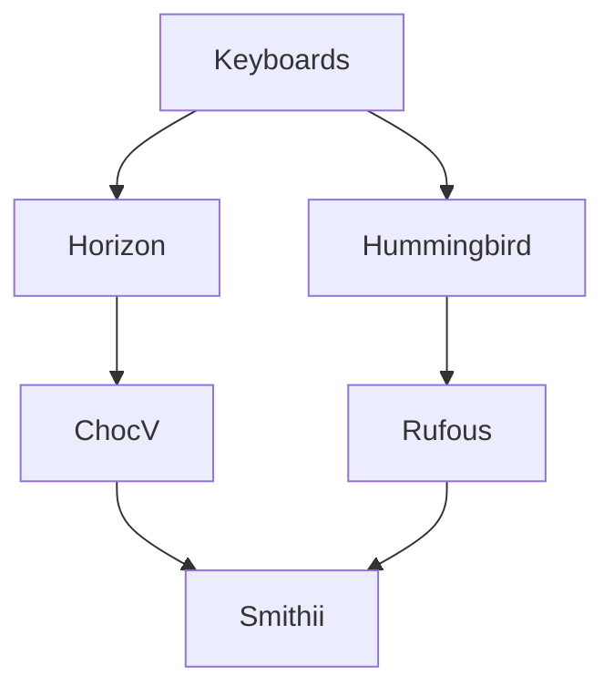

# Tlalocohyla Smithii

These keyboards were my inspiration:

In a nutshell...
- I really liked the Horizon/ChocV construction design and the end result of a low-profile case, just PCBs, nuts and screws.
- And I also liked the Hummingbird/Rufous 30-key layout and the awesome Xiao BLE to package a full Bluetooth keyboard powered by ZMK firmware.

How it looks like?

## BOM - WIP
|Qty|Materials|-|
|-|-|-|
|1|Main PCB|-|
|1|Bottom PCB|-|
|1|Top PCB|-|
|30|1N4148 SOD-123 diodes|-|
|30|Keycaps|-|
|30|Choc Switches V1|-|
|2|Pogo pin 5mm|[AliExpress (DHYXDD Store) - 5mm](https://es.aliexpress.com/item/1005004016701633.html)|
|1|Machined pin header|-|
|1|Seeeduino Xiao BLE|-|
|1|Li-Po battery (Optional)|I used 501240|
|5|M2 6mm Screws|[AliExpress (wuhushiyu) - 200PCS-M2 Mix - Black/White](https://www.aliexpress.com/item/32862529967.html)|
|5|M2 Nuts|See &uarr;|
|3|M2 6mm Male-Female standoffs|See &uarr;|
|1|JST-PH  male right angle connector (Optional)|-|
|1|Tact Switch (Optional, Reset)|-|
|1|MSK-12C02 (Optional, Power cut-off)|-|
|5~6|2mm tall rubber bumpons|-|
